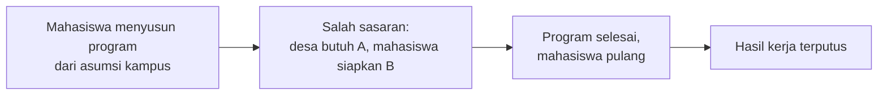
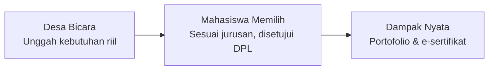
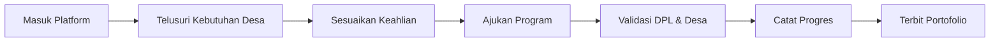

# BaktiNusantara

**Platform kolaborasi berbasis web untuk menyelaraskan kebutuhan riil desa dengan program kerja KKN mahasiswa, berlandaskan 17 SDGs.**

Dikembangkan oleh Tim Memasak Bersama Gayatama untuk *International Web Technology Competition* — Universitas Negeri Surabaya, 2026.

<div align="center">

**[📖 Tentang](#tentang)** &nbsp;•&nbsp; **[🛠️ Instalasi](#instalasi)** &nbsp;•&nbsp; **[🔑 Akun Demo](#demo)** &nbsp;•&nbsp; **[🧪 Testing](#testing)** &nbsp;•&nbsp; **[❓ FAQ](#faq)**

</div>

---
<a name="tentang"></a>
## 📖 Tentang BaktiNusantara

### Mengapa Program KKN Butuh BaktiNusantara

Setiap tahun, ribuan mahasiswa dari berbagai perguruan tinggi di Indonesia berangkat ke desa untuk menjalankan Kuliah Kerja Nyata (KKN). Niatnya selalu baik: mengabdi, belajar dari masyarakat, dan membawa perubahan bagi desa yang mereka tuju.

Masalahnya, program kerja itu sering disusun sebelum mahasiswa benar-benar mengenal desanya. Rencana kegiatan biasanya dibuat berdasarkan asumsi kampus atau pengalaman kelompok sebelumnya, bukan dari kebutuhan yang benar-benar dirasakan warga.



Akibatnya, program yang dijalankan kerap bersifat seremonial — sekali jalan, tanpa tindak lanjut. Di sisi lain, perangkat desa dan pengelola BUMDes juga belum punya wadah resmi untuk menyampaikan kendala yang sebenarnya mereka hadapi: legalitas kemasan UMKM, penanganan stunting, sampai penataan administrasi desa. Komunikasi yang ada sering berhenti di percakapan pribadi, dan begitu masa tugas mahasiswa selesai, hasil kerjanya ikut tersimpan di folder yang tidak pernah dibuka lagi oleh siapa pun.

BaktiNusantara dibangun untuk menutup celah itu — menata ulang hubungan antara desa, mahasiswa, dan kampus supaya setiap langkah pengabdian bertumpu pada persoalan yang nyata.

### Gagasan: Membalik Alurnya

Selama ini KKN berjalan satu arah: mahasiswa datang membawa rencana, desa menerima. BaktiNusantara membalik urutan itu. Desa bicara lebih dulu soal apa yang mereka butuhkan, baru kemudian mahasiswa memilih program yang sesuai dengan bidang ilmu kelompoknya.



Dengan begitu, desa bukan lagi sekadar lokasi penempatan. Mereka jadi mitra yang ikut menentukan arah pembangunan wilayahnya sendiri, bersama civitas akademika.

### Alur Kerja

Prosesnya dirancang sesederhana mungkin — termasuk untuk perangkat desa yang baru pertama kali memakai sistem digital semacam ini.



1. **Desa menyampaikan kebutuhan.** Perangkat desa menuliskan kendala atau program yang perlu pendampingan, lengkap dengan rincian masalah, lokasi, dan batas waktu pengajuan.
2. **Mahasiswa mencari program yang cocok.** Kelompok menjelajahi daftar kebutuhan desa, mempertimbangkan kesesuaian bidang ilmu, dan mengecek perkiraan jarak dari kampus ke lokasi.
3. **Rencana disusun bersama, lalu disetujui.** Mahasiswa menyusun rancangan program bersama Dosen Pembimbing Lapangan (DPL), sebelum akhirnya ditinjau dan diputuskan oleh pihak desa.
4. **Progres dicatat selama pengabdian berjalan.** Mahasiswa melaporkan capaian secara berkala, dan laporan itu bisa dipantau langsung oleh dosen pembimbing maupun perangkat desa.
5. **Hasil kerja disahkan jadi dokumentasi permanen.** Begitu masa pengabdian selesai, desa mengesahkan hasil karya mahasiswa menjadi portofolio resmi dan sertifikat digital — tersimpan rapi sebagai rujukan untuk periode KKN berikutnya.

### Fitur Utama

- **Katalog Kebutuhan Desa** — wadah resmi bagi pemerintah desa untuk mempublikasikan kebutuhan prioritas, mulai dari penguatan UMKM, sanitasi lingkungan, sampai digitalisasi layanan desa.
- **Peta Lokasi & Estimasi Jarak** — menampilkan sebaran pos kebutuhan desa secara spasial, supaya mahasiswa bisa memperkirakan waktu tempuh, mobilitas, dan kesiapan logistik sebelum berangkat.
- **Penyelarasan Kompetensi** — membantu mahasiswa menemukan kebutuhan desa yang paling relevan dengan latar belakang program studinya, supaya solusi yang diberikan benar-benar aplikatif.
- **Peninjauan & Persetujuan oleh Desa** — wewenang menyeleksi dan menyetujui proposal kelompok mahasiswa ada sepenuhnya di tangan desa, bukan ditentukan sepihak oleh kampus.
- **Portofolio Tervalidasi & E-Sertifikat** — modul pelatihan, desain kemasan, peta potensi desa: setiap karya nyata mahasiswa didokumentasikan dan disahkan langsung oleh kepala desa.
- **Ruang Pemantauan untuk Kampus** — LPPM dan DPL bisa mendampingi kelompok bimbingan, meninjau laporan mingguan, dan mengevaluasi capaian program dari satu tempat yang sama.

### Manfaat untuk Tiap Pihak

| Pihak | Yang mereka dapatkan |
|---|---|
| Pemerintah & mitra desa | Bantuan keahlian mahasiswa yang tepat sasaran, arsip hasil kegiatan yang rapi, dan kendali penuh atas program yang masuk ke desanya. |
| Mahasiswa KKN | Kepastian lokasi dan program sebelum berangkat, kegiatan yang sesuai jurusan, dan portofolio pengabdian yang diakui resmi oleh desa. |
| DPL & kampus | Pemantauan bimbingan yang terpusat, evaluasi lapangan yang lebih mudah, dan kepastian keselamatan mahasiswa lewat pencatatan jarak lokasi. |
| Warga & pelaku UMKM | Kanal aduan langsung untuk menyampaikan aspirasi lingkungan, plus pendampingan usaha berkelanjutan dari mahasiswa. |

### Keterkaitan dengan SDGs

Setiap kebutuhan desa yang diunggah dikaitkan dengan Tujuan Pembangunan Berkelanjutan (SDGs) yang relevan, sehingga kontribusi mahasiswa bisa diukur dampaknya secara konkret:

| SDG | Bentuk Kontribusi |
|---|---|
| SDG 1 — Tanpa Kemiskinan | Pendampingan pembukuan dan pengembangan UMKM |
| SDG 3 — Kehidupan Sehat | Edukasi gizi dan pencegahan stunting |
| SDG 4 — Pendidikan Berkualitas | Bimbingan belajar dan literasi digital desa |
| SDG 8 — Pekerjaan Layak | Digitalisasi pemasaran produk desa |
| SDG 9 — Industri & Inovasi | Penataan administrasi dan sistem informasi desa |
| SDG 11 — Kawasan Berkelanjutan | Pemetaan wilayah dan potensi lokal |
| SDG 13 — Penanganan Perubahan Iklim | Pengelolaan sampah dan penghijauan |
| SDG 17 — Kemitraan untuk Mencapai Tujuan | Sinergi antara perguruan tinggi dan desa |

### Yang Membedakan BaktiNusantara

| Aspek | KKN Konvensional | BaktiNusantara |
|---|---|---|
| Titik awal program | Disusun mahasiswa dari asumsi atau survei singkat setelah tiba di lokasi | Diawali dari kebutuhan yang diunggah langsung oleh desa |
| Akses informasi desa | Terbatas pada komunikasi personal, tidak tercatat | Terbuka lewat katalog kebutuhan yang bisa diakses siapa saja |
| Peran desa | Cenderung pasif, sekadar lokasi penempatan | Aktif menyeleksi dan menyetujui proposal yang masuk |
| Kesesuaian keilmuan | Rawan tidak nyambung antara jurusan dan kebutuhan | Diarahkan lewat pencocokan kompetensi ke pos kebutuhan spesifik |
| Keberlanjutan hasil | Kerja terputus begitu masa KKN selesai | Tersimpan dalam portofolio digital, jadi rujukan periode berikutnya |

### Keberlanjutan Jangka Panjang

Tiga hal yang membuat BaktiNusantara dirancang untuk bertahan lebih dari satu periode KKN:

1. **Estafet data antarperiode** — kebutuhan desa yang belum tuntas di satu periode bisa dilanjutkan kelompok berikutnya, sehingga pembangunan desa tidak perlu dimulai dari nol tiap tahun.
2. **Penguatan lembaga desa** — program yang tepat sasaran membantu BUMDes dan Karang Taruna menjadi lebih mandiri mengelola potensi lokalnya sendiri.
3. **Efisiensi pengabdian kampus** — LPPM punya data sebaran KKN yang merata, sehingga tidak ada penumpukan mahasiswa di desa yang sama sementara desa lain justru kekurangan bantuan.

### Penutup

BaktiNusantara berangkat dari gagasan sederhana: kegiatan KKN akan lebih bermakna kalau titik awalnya adalah kebutuhan desa itu sendiri, bukan asumsi yang dibawa dari kampus. Lewat keterbukaan informasi, kesesuaian keilmuan, dan dokumentasi kerja yang tidak berhenti begitu mahasiswa pulang, pengabdian ini diharapkan bisa terus berlanjut dari satu periode KKN ke periode berikutnya.

**[⬆ Kembali ke navigasi](#baktinusantara)**

---
<a name="instalasi"></a>
## 🛠️ Panduan Instalasi & Pengoperasian Sistem

Dokumen ini berisi panduan teknis langkah demi langkah untuk melakukan instalasi, konfigurasi basis data, pengaturan variabel lingkungan, hingga menjalankan layanan **Backend (Laravel 11)** dan **Frontend (Next.js 14)** secara lokal maupun pengujian oleh Dewan Juri.

### 📋 Prasyarat Sistem

| Perangkat Lunak | Versi Minimal | Keterangan & Ekstensi yang Dibutuhkan |
| :--- | :--- | :--- |
| **PHP** | `^8.2` atau `^8.3` | Ekstensi aktif: `pdo_mysql`, `curl`, `mbstring`, `fileinfo`, `gd`, `openssl`, `tokenizer`, `xml` |
| **Composer** | `^2.6` | Package manager resmi untuk dependensi PHP |
| **Node.js** | `^18.18` atau `^20.x` | Runtime JavaScript untuk Next.js frontend |
| **NPM** | `^9.x` atau `^10.x` | Package manager resmi Node.js |
| **MySQL Server** | `^8.0` / MariaDB `^10.4` | Basis data relasional (bisa via XAMPP, Laragon, atau Docker) |
| **Git** | Versi terbaru | Untuk manajemen source code |

### ⚙️ Topologi & Port Standar

```
┌───────────────────────────────┐               ┌───────────────────────────────┐
│     FRONTEND (Next.js 14)     │ ── REST API ──►│     BACKEND (Laravel 11)      │
│     http://localhost:3000     │◄── JSON/Token─│     http://127.0.0.1:8000     │
└───────────────────────────────┘               └───────────────┬───────────────┘
                                                                │
                                                              MySQL
                                                      (Port 3306: baktinusantaradb)
```

<details>
<summary><strong>🚀 Instalasi Backend (Laravel 11)</strong> — klik untuk buka</summary>

#### 3.1 Masuk ke Folder Backend
```bash
cd Backend/baktinusantara-laravel
```

#### 3.2 Pasang Dependensi PHP
```bash
composer install
```

#### 3.3 Generate Encryption Key
```bash
php artisan key:generate
```

#### 3.4 Buat Database & Jalankan Migrasi + Seeder
Pastikan service MySQL Anda sudah menyala (misal via XAMPP), lalu buat database baru bernama **`baktinusantaradb`**.

```bash
php artisan migrate --seed
```

> **Catatan:** Perintah `--seed` akan mengisi akun demo untuk 5 peran (*Super Admin, LPPM Universitas, Dosen DPL, Perangkat Desa, Mahasiswa*), katalog pos kebutuhan desa berbasis 17 SDGs, data master wilayah, dan riwayat KKN.

#### 3.5 Buat Tautan Simbolik Storage Publik
```bash
php artisan storage:link
```

#### 3.6 Jalankan Server Backend
```bash
php artisan serve
```
*Layanan RESTful API Backend kini aktif di: **`http://127.0.0.1:8000`** (Base API: `http://127.0.0.1:8000/api`).*

</details>

<details>
<summary><strong>💻 Instalasi Frontend (Next.js 14)</strong> — klik untuk buka</summary>

#### 4.1 Buka Terminal Baru & Masuk ke Folder Frontend
```bash
cd Frontend/baktinusantara-frontend
```

#### 4.2 Pasang Dependensi Node.js
```bash
npm install
```

#### 4.3 Konfigurasi File Environment (`.env.local`)
```bash
cp .env.example .env.local
```

Pastikan isi file `.env.local` memiliki variabel berikut:
```env
# Backend API Base URL
NEXT_PUBLIC_API_URL=http://localhost:8000
NEXT_PUBLIC_BASE_URL=http://localhost:3000

# Google OAuth 2.0 Client ID
NEXT_PUBLIC_GOOGLE_CLIENT_ID=your-google-client-id.apps.googleusercontent.com
GOOGLE_CLIENT_SECRET=your-google-client-secret
```

#### 4.4 Jalankan Server Development Frontend
```bash
npm run dev
```
*Buka peramban (browser) Anda dan akses: **`http://localhost:3000`**.*

</details>

**[⬆ Kembali ke navigasi](#baktinusantara)**

---
<a name="demo"></a>
## 🔑 Akun Uji Coba Dewan Juri (Demo Accounts)

Database Seeder telah menyediakan akun demo siap pakai untuk menguji seluruh modul hak akses berjenjang:

| Peran (Role) | Alamat Email | Kata Sandi | Dashboard Utama | Fitur Utama yang Dapat Diuji |
| :--- | :--- | :--- | :--- | :--- |
| **Super Admin** | `admin@baktinusantara.id` | `password` | `/admin/dashboard` | Verifikasi SK Desa & Kampus, suspend/activate entitas, kelola sebaran nasional. |
| **LPPM Kampus** | `unesa@unesa.ac.id` | `password` | `/kampus/dashboard` | Batch import dosen & mahasiswa, monitoring kelompok internal, evaluasi bimbingan. |
| **Dosen DPL** | `dosen.budi@unesa.ac.id` | `password` | `/dosen/dashboard` | Validasi kelayakan proposal (layak/revisi), review logbook mingguan mahasiswa. |
| **Perangkat Desa** | `desa.sukamaju@desa.id` | `password` | `/perangkat-desa/dashboard` | Terbitkan pos kebutuhan baru (SDGs), verifikasi proposal, pengesahan luaran & BAST. |
| **Mahasiswa KKN** | `mahasiswa.ahmad@mhs.unesa.ac.id` | `password` | `/mahasiswa/dashboard` | Buat kelompok, pilih pos via Haversine & AI matching, submit logbook, unggah luaran. |

> **Login Instan:** Pengguna juga dapat langsung menguji login SSO menggunakan tombol **"Masuk dengan Akun Google"** di halaman `/login`.

**[⬆ Kembali ke navigasi](#baktinusantara)**

---
<a name="testing"></a>
## 🧪 Verifikasi & Menjalankan Automated Tests

<details>
<summary><strong>Uji Fitur & Keamanan Backend (PHPUnit)</strong></summary>

Backend dilengkapi dengan **81 test suites otomatis (591 assertions)** yang menguji seluruh alur bisnis, perhitungan Haversine, smart matching AI, webhook WhatsApp, hingga integritas kriptografi e-sertifikat.

```bash
cd Backend/baktinusantara-laravel
php artisan test
```

*Seluruh pengujian berjalan secara otomatis di atas database SQLite in-memory (`:memory:`) sehingga data pengujian di MySQL tidak akan tertimpa.*

</details>

<details>
<summary><strong>Uji Build Produksi Frontend (Type-Checking & Bundle)</strong></summary>

```bash
cd Frontend/baktinusantara-frontend
npm run build
```
*Hasil yang diharapkan: **Compiled successfully (68/68 static & dynamic routes generated)**.*

</details>

**[⬆ Kembali ke navigasi](#baktinusantara)**

---
<a name="faq"></a>
## ❓ Troubleshooting Masalah Umum

<details>
<summary><strong>Port 8000 atau Port 3000 sudah terpakai</strong></summary>

Jika port 8000 atau 3000 sedang digunakan oleh aplikasi lain di komputer Anda:

* **Backend**: Jalankan pada port kustom:
  ```bash
  php artisan serve --port=8080
  ```
  *(Jangan lupa sesuaikan `NEXT_PUBLIC_API_URL=http://localhost:8080` di `.env.local` frontend)*
* **Frontend**: Jalankan pada port kustom:
  ```bash
  npm run dev -- -p 3001
  ```

</details>

<details>
<summary><strong>Error koneksi database: Unknown database 'baktinusantaradb'</strong></summary>

Pastikan Anda sudah membuat database kosong bernama `baktinusantaradb` di MySQL (bisa melalui phpMyAdmin atau MySQL CLI: `CREATE DATABASE baktinusantaradb;`), lalu ulangi:
```bash
php artisan migrate --seed
```

</details>

<details>
<summary><strong>File upload / gambar tidak muncul</strong></summary>

Pastikan Anda telah menjalankan perintah tautan storage publik di backend:
```bash
php artisan storage:link
```

</details>

<details>
<summary><strong>Google OAuth menampilkan Error 400: invalid_request</strong></summary>

Pastikan variabel `GOOGLE_CLIENT_ID` di file `.env` backend dan `NEXT_PUBLIC_GOOGLE_CLIENT_ID` di file `.env.local` frontend sudah terisi dengan benar, dan pastikan URL callback (misal `http://localhost:8000/api/auth/google/callback` untuk lokal, atau domain Railway untuk produksi) telah terdaftar di **Authorized Redirect URIs** Google Cloud Console.

</details>

**[⬆ Kembali ke navigasi](#baktinusantara)**

---


*Tim Memasak Bareng Gayatama — Universitas Negeri Surabaya, 2026*