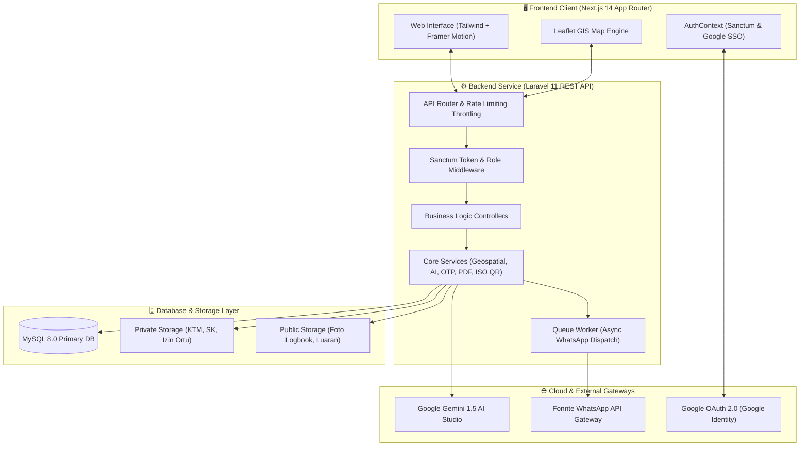
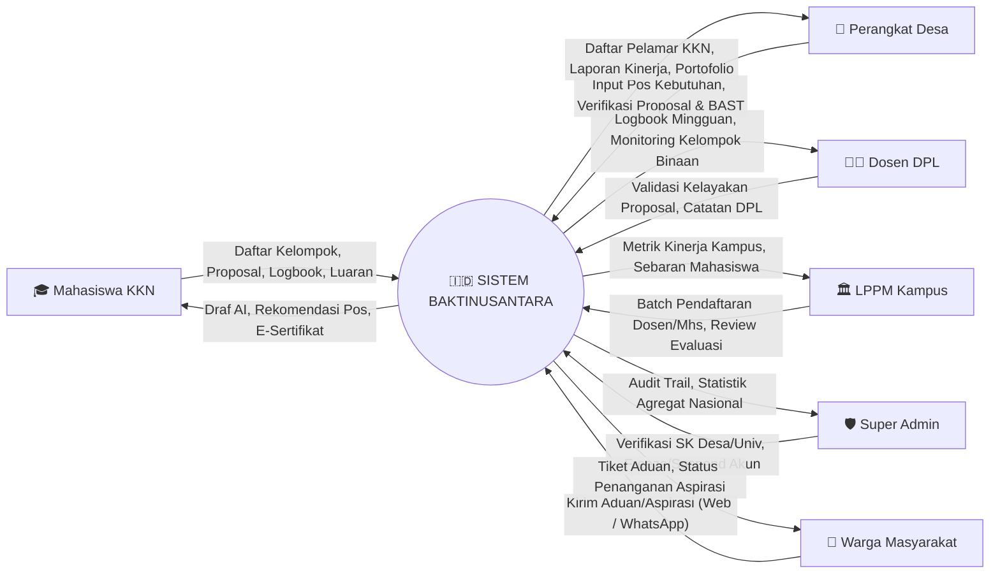
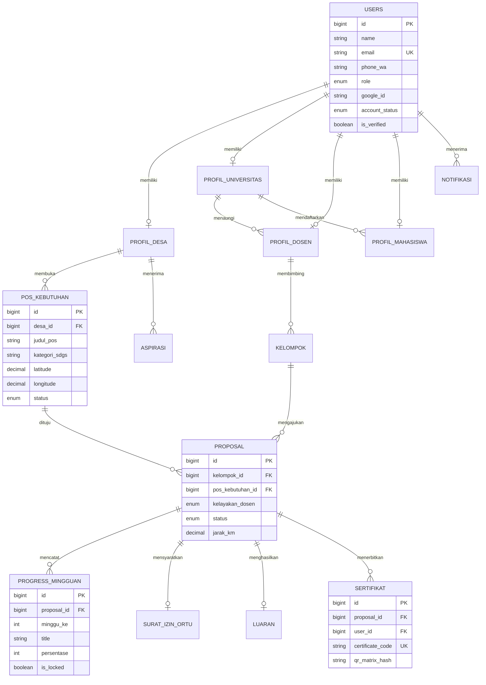

# 🇮🇩 BaktiNusantara
### *Platform Terpadu Kolaborasi Kuliah Kerja Nyata (KKN) & Pengabdian Masyarakat Berbasis 17 Sustainable Development Goals (SDGs) dan Potensi Desa Presisi*

<div align="center">

[](https://laravel.com)
[-000000?style=for-the-badge&logo=next.js&logoColor=white)](https://nextjs.org)
[](https://www.typescriptlang.org/)
[](https://www.php.net/)
[](https://www.mysql.com/)
[](https://tailwindcss.com)
[](https://ai.google.dev/)
[-brightgreen?style=for-the-badge&logo=checkmarx&logoColor=white)](Backend/baktinusantara-laravel)
[](LICENSE)

</div>

---

## 📌 Daftar Isi (Table of Contents)
1. [Latar Belakang & Problem Statement](#-latar-belakang--problem-statement)
2. [Solusi & Fitur Unggulan (Core Innovations)](#-solusi--fitur-unggulan-core-innovations)
3. [Teknologi yang Digunakan (Technology Stack)](#-teknologi-yang-digunakan-technology-stack)
4. [Arsitektur Sistem & Diagram Alur (System Architecture)](#-arsitektur-sistem--diagram-alur)
5. [Tata Kelola Hak Akses Berjenjang (Role Governance Matrix)](#-tata-kelola-hak-akses-berjenjang-role-governance)
6. [Skema Basis Data & ERD (Entity Relationship Diagram)](#-skema-basis-data--erd)
7. [Panduan Instalasi & Menjalankan Sistem (Installation Guide)](#-panduan-instalasi--menjalankan-sistem-installation-guide)
8. [Akun Pengujian Demo (Test Credentials)](#-akun-pengujian-demo-test-credentials)
9. [Automated Testing & Jaminan Kualitas (QA & Security)](#-automated-testing--jaminan-kualitas-qa--security)
10. [Spesifikasi API Endpoint (API Reference)](#-spesifikasi-api-endpoint-api-reference)
11. [Struktur Direktori Repositori (Project Structure)](#-struktur-direktori-repositori-project-structure)

---

## 📖 Latar Belakang & Problem Statement

Kuliah Kerja Nyata (KKN) dan Pengabdian Kepada Masyarakat merupakan pilar penting dalam implementasi Tri Dharma Perguruan Tinggi di Indonesia. Namun, pelaksanaan KKN konvensional saat ini menghadapi berbagai tantangan kritis di lapangan:

1. **Ketidaksesuaian Kebutuhan & Keahlian (*Skill Mismatch*)**: Proposal program kerja mahasiswa sering kali tidak menjawab permasalahan riil desa karena ketiadaan data kebutuhan presisi berbasis potensi desa dan 17 indikator SDGs.
2. **Birokrasi & Administrasi Terfragmentasi**: Proses perizinan desa, penugasan Dosen Pembimbing Lapangan (DPL), monitoring logbook mingguan, hingga Berita Acara Serah Terima (BAST) masih dilakukan secara manual menggunakan dokumen fisik yang rawan hilang dan sulit dipantau LPPM.
3. **Ketiadaan Pengawasan Jarak & Aspek Keselamatan**: Lokasi KKN lintas pulau atau jarak jauh sering kali minim mitigasi perizinan wali/orang tua dan pemantauan geospasial yang akurat.
4. **Keterbatasan Akses Partisipasi Warga**: Warga desa kesulitan menyampaikan aspirasi atau aduan secara langsung ke tim pelaksana KKN tanpa prosedur formal yang rumit.

**BaktiNusantara** hadir sebagai platform ekosistem digital terpadu yang menjembatani **Pemerintah Desa, LPPM Perguruan Tinggi, Dosen Pembimbing Lapangan (DPL), Mahasiswa KKN, dan Warga Masyarakat** melalui integrasi kecerdasan buatan (AI), analitik geospasial, gerbang komunikasi WhatsApp bot dua arah, serta tata kelola hak akses berjenjang yang aman.

---

## 💡 Solusi & Fitur Unggulan (Core Innovations)

```
┌──────────────────────────────────────────────────────────────────────────────────┐
│                             EKOSISTEM BAKTINUSANTARA                             │
├───────────────────┬────────────────────┬───────────────────┬─────────────────────┤
│   🤖 AI Engine    │  🗺️ Geospatial GIS │  📱 WhatsApp Bot  │  🔐 Role Governance │
│  Smart Matching   │ Haversine Distance │ Two-Way Webhook   │ Multi-tier RBAC     │
│  Auto-Draft Proker│ Peta Sebaran SDGs  │ Realtime Alerts   │ Google OAuth 2.0    │
│  Logbook Generator│ Parent Consent Flag│ Aduan & Tracking  │ ISO 18004 QR Matrix │
└───────────────────┴────────────────────┴───────────────────┴─────────────────────┘
```

### 1. 🤖 AI Real-Time Smart Matching & Copilot (*Aira*)
* **Algoritma Pencocokan Presisi (0–100%)**: Memetakan jurusan, profil keahlian, dan minat mahasiswa dengan pos kebutuhan riil desa yang terdaftar.
* **Auto-Generator Proposal & Logbook**: Menghasilkan draf proposal program kerja dan logbook mingguan terstruktur berstandar format akademik LPPM dengan model Google Gemini AI.
* **Realtime Context Injection**: Asisten AI kontekstual yang memahami basis data pos desa, capaian SDGs daerah, dan profil kelompok secara langsung.

### 2. 🗺️ Mesin Geospasial & Kalkulasi Jarak Haversine (*GIS Engine*)
* **Peta Interaktif Sebaran KKN**: Visualisasi klaster pos kebutuhan desa dan kelompok KKN di seluruh wilayah Indonesia dengan *Leaflet GIS*.
* **Filter Radius & Jarak Presisi**: Menghitung jarak garis lurus (*Haversine Formula*) antara lokasi asal kampus/mahasiswa dengan desa tujuan.
* **Automated Safety Gate (>1.000 km)**: Secara otomatis mendeteksi lokasi KKN jarak jauh dan mewajibkan unggah *Surat Izin Orang Tua/Wali* sebelum proposal dapat disetujui.

### 3. 📱 Two-Way WhatsApp Gateway & Webhook Bot (Fonnte Engine)
* **Aspirasi & Aduan Warga Berbasis Bot**: Warga desa dapat mengirimkan aduan cukup via chat WhatsApp; bot otomatis mencatat aspirasi ke basis data MySQL dan menerbitkan nomor tiket aduan.
* **Pelacakan Tiket & Status Proposal**: Mahasiswa dan warga dapat mengecek status persetujuan secara instan melalui interaksi bot interaktif.
* **Notifikasi Transaksional Realtime**: Notifikasi otomatis via antrean asinkron (*Queue Jobs*) saat ada proposal baru, validasi DPL, maupun verifikasi luaran oleh Kepala Desa.

### 4. 🔐 Tata Kelola Autentikasi Berjenjang & Google OAuth 2.0
* **Otoritas Berjenjang Akademik**: LPPM mengontrol hak akses dosen dan mahasiswa di bawah naungan kampusnya; Super Admin memverifikasi SK Kepala Desa dan Perguruan Tinggi.
* **Google Identity Security**: Integrasi Google OAuth 2.0 dengan proteksi penolakan akun tak terdaftar (`404 UNREGISTERED_ACCOUNT`) guna mencegah akses liar, serta mekanisme pembekuan akun (*Suspension Gate*).

### 5. 📜 Auto-Generate E-Sertifikat & Pure PHP ISO/IEC 18004 QR Matrix
* **Verifikasi Publik Instan**: Setiap sertifikat KKN dilengkapi QR Code standar ISO/IEC 18004 format vektor SVG yang digenerate murni di backend tanpa API pihak ketiga.
* **Penerbitan Otomatis Pasca-BAST**: Sertifikat PDF resmi diterbitkan otomatis setelah Kepala Desa menyetujui dokumen BAST dan luaran akhir kelompok.

---

## 🛠️ Teknologi yang Digunakan (Technology Stack)

### **Frontend Stack (Aplikasi Web Klien)**
* **Core Framework**: [Next.js 14](https://nextjs.org/) (App Router, Server Components & Client Hooks)
* **Bahasa Pemrograman**: [TypeScript 5.7](https://www.typescriptlang.org/) (Strict Type Checking)
* **Styling & Design System**: [Tailwind CSS 3.4](https://tailwindcss.com/) & [PostCSS](https://postcss.org/)
* **Iconography & Visual Assets**: [Lucide React](https://lucide.dev/)
* **Animasi & Interaktivitas**: [Framer Motion 13](https://www.framer.com/motion/)
* **Peta Geospasial**: [Leaflet 1.9](https://leafletjs.com/) & [React-Leaflet 4.2](https://react-leaflet.js.org/)
* **Visualisasi Grafik**: [Recharts 2.15](https://recharts.org/)
* **Manajemen State Global**: [Zustand 5.0](https://zustand-demo.pmnd.rs/) & React Context API
* **Form & Validasi Skema**: [React Hook Form 7](https://react-hook-form.com/) & [Zod 3.24](https://zod.dev/)
* **Notifikasi Web & Toast**: [Sonner](https://sonner.emilkowal.ski/) & Service Worker [Web-Push API](https://developer.mozilla.org/en-US/docs/Web/API/Push_API)

### **Backend Stack (RESTful API Service)**
* **Core Framework**: [Laravel 11.x](https://laravel.com/)
* **Runtime & Bahasa**: [PHP 8.2+](https://www.php.net/)
* **Autentikasi & Otorisasi**: [Laravel Sanctum](https://laravel.com/docs/11.x/sanctum) & [Laravel Socialite](https://laravel.com/docs/11.x/socialite)
* **Google OAuth Verification**: [Google API PHP Client](https://github.com/googleapis/google-api-php-client)
* **Komunikasi WhatsApp**: [Fonnte API](https://fonnte.com/) via Guzzle & Custom Webhook Handler
* **PDF & Dokumen Resmi**: [DomPDF](https://github.com/dompdf/dompdf)
* **AI Intelligence**: [Google Gemini 1.5 Flash / Pro REST API](https://ai.google.dev/)
* **QR Code Generator**: Pure PHP Matrix Algorithm (ISO/IEC 18004 Standard compliant)

### **Basis Data & Infrastruktur**
* **Primary Database**: MySQL 8.0 / MariaDB (Optimized Indexing & Relational Constraints)
* **Testing Database**: SQLite (`:memory:`)
* **File Storage**: Isolated Private Storage (KTM, SK Desa, Surat Izin) & Public CDN Storage

---

## 🏛️ Arsitektur Sistem & Diagram Alur

### Diagram Arsitektur Komponen


### Data Flow Diagram (DFD Level 0 — Context Diagram)


---

## 👥 Tata Kelola Hak Akses Berjenjang (Role Governance)

Platform mengadopsi **Role-Based Access Control (RBAC)** berjenjang dengan matriks hak akses berikut:

| Modul / Fitur Sistem | Super Admin | LPPM Univ | Dosen DPL | Mitra Desa | Mahasiswa KKN | Warga |
| :--- | :---: | :---: | :---: | :---: | :---: | :---: |
| **Verifikasi SK Desa & Universitas** | ✅ **Full** | ❌ | ❌ | ❌ | ❌ | ❌ |
| **Suspend / Activate Entitas** | ✅ **Full** | ❌ | ❌ | ❌ | ❌ | ❌ |
| **Pendaftaran Batch Dosen & Mhs** | ❌ | ✅ **Full** | ❌ | ❌ | ❌ | ❌ |
| **Monitoring Kelompok Kampus** | 👁️ Read | ✅ **Full** | ❌ | ❌ | ❌ | ❌ |
| **Validasi Kelayakan Proposal** | ❌ | ❌ | ✅ **Full** | ❌ | ❌ | ❌ |
| **Publikasi Pos Kebutuhan KKN** | ❌ | ❌ | ❌ | ✅ **Full** | ❌ | ❌ |
| **Approval Proposal & BAST Akhir** | ❌ | ❌ | ❌ | ✅ **Full** | ❌ | ❌ |
| **Pengajuan Kelompok & Proposal** | ❌ | ❌ | ❌ | ❌ | ✅ **Full** | ❌ |
| **Pengisian Logbook Mingguan** | ❌ | ❌ | 👁️ Review | 👁️ Review | ✅ **Full** | ❌ |
| **Unduh E-Sertifikat Resmi** | ❌ | ❌ | ❌ | ❌ | ✅ **Full** | ❌ |
| **Kirim Aspirasi & Cek Tiket WA** | ❌ | ❌ | ❌ | 👁️ Review | ❌ | ✅ **Full** |

---

## 🗄️ Skema Basis Data & ERD

Sistem dikelola oleh **16 tabel relasional terstruktur** yang menjamin integritas data:



---

## 💻 Panduan Instalasi & Menjalankan Sistem (Installation Guide)

### **Prasyarat Sistem (Prerequisites)**
* **PHP**: `>= 8.2` (Ekstensi aktif: `pdo_mysql`, `curl`, `mbstring`, `fileinfo`, `gd`, `openssl`)
* **Composer**: `>= 2.6`
* **Node.js**: `>= 18.x` & **NPM**: `>= 9.x`
* **MySQL Server**: 8.0+ / MariaDB 10.4+

---

### **1. Setup Backend (Laravel 11 REST API)**
```bash
# 1. Masuk ke direktori backend
cd Backend/baktinusantara-laravel

# 2. Pasang dependensi PHP melalui Composer
composer install

# 3. Buat salinan konfigurasi environment
cp .env.example .env

# 4. Generate Application Key
php artisan key:generate

# 5. Konfigurasikan koneksi database MySQL di file .env:
#    DB_DATABASE=baktinusantaradb
#    DB_USERNAME=root
#    DB_PASSWORD=

# 6. Jalankan migrasi tabel beserta seed data demo awal
php artisan migrate --seed

# 7. Buat symbolic link folder storage publik
php artisan storage:link

# 8. Jalankan development server backend
php artisan serve
```
> 🌐 **Backend API aktif pada:** `http://127.0.0.1:8000` (Endpoint API: `http://127.0.0.1:8000/api`)

---

### **2. Setup Frontend (Next.js 14 App Router)**
```bash
# 1. Buka terminal baru dan masuk ke direktori frontend
cd Frontend/baktinusantara-frontend

# 2. Pasang paket dependensi JavaScript / Node.js
npm install

# 3. Siapkan file konfigurasi environment lokal
cp .env.example .env.local

# 4. Jalankan development server frontend
npm run dev
```
> 🌐 **Frontend Web aktif pada:** `http://localhost:3000`

---

## 🔑 Akun Pengujian Demo (Test Credentials)

Semua akun pengujian di bawah ini telah disiapkan secara otomatis oleh Seeder database untuk memudahkan proses evaluasi dewan juri:

| Peran (Role) | Email Login | Kata Sandi | Keterangan Akun & Skenario Pengujian |
| :--- | :--- | :---: | :--- |
| **🛡️ Super Admin** | `admin@baktinusantara.id` | `password` | Akses verifikasi entitas desa/kampus & monitoring sistem nasional. |
| **🏛️ LPPM Kampus (Verified)** | `unesa@unesa.ac.id` | `password` | Kelola dosen DPL, batch registrasi mahasiswa, pantau metrik kampus. |
| **🏛️ LPPM Kampus (Pending)** | `unair@unair.ac.id` | `password` | Pengujian skenario akun kampus baru menunggu verifikasi Super Admin. |
| **👨‍🏫 Dosen Pembimbing (DPL)** | `dosen.budi@unesa.ac.id` | `password` | Bimbingan Kelompok 1, review progres logbook 1–4, validasi kelayakan. |
| **🏡 Mitra Perangkat Desa** | `desa.sukamaju@desa.id` | `password` | Buat pos KKN SDGs, persetujuan proposal masuk, verifikasi luaran & BAST. |
| **🎓 Mahasiswa (Ketua Tim)** | `ahmad.mhs@unesa.ac.id` | `password` | Ketua Kelompok 1, pengajuan proposal, izin orang tua, submit logbook. |
| **🎓 Mahasiswa (Anggota)** | `siti.mhs@unesa.ac.id` | `password` | Anggota Kelompok 1, pengisian logbook mingguan terverifikasi. |

---

## 🧪 Automated Testing & Jaminan Kualitas (QA & Security)

### **1. Backend Automated Test Suite (PHPUnit)**
Sistem backend dilengkapi **81 automated test cases** (590 assertions) yang mencakup pengujian unit dan fitur fungsional secara komprehensif:

```bash
cd Backend/baktinusantara-laravel
php artisan test
```

**Hasil Pengujian:**
```
Tests:    81 passed (590 assertions)
Duration: 7.00s (SQLite In-Memory Isolation)
Status:   100% Passed
```

*Cakupan Test Suite:*
- `GoogleAuthGovernanceTest`: Verifikasi Google OAuth 2.0, login token, isolasi akun tak terdaftar (`404`), dan pembekuan akun (`403`).
- `GeospatialMapTest`: Kalkulasi jarak Haversine, radius filter, validasi auto-mandatory surat izin ortu > 1.000 km.
- `AiContextTest`: Endpoint konteks realtime, smart matching scoring, generator draf proposal dan logbook.
- `WhatsAppWebhookTest`: Verifikasi webhook signature, penanganan pesan dua arah warga, tracking tiket.
- `ProgressTest`: Validasi urutan kronologis logbook mingguan, penguncian data (*tamper-proof*), dan hak akses DPL/Desa.
- `CertificateVerificationTest`: Penerbitan sertifikat digital otomatis, hashing matriks QR Code, dan validasi kode sertifikat publik.

---

### **2. Frontend Production Build Validation**
Frontend telah divalidasi dan lolos kompilasi produksi Next.js tanpa error:

```bash
cd Frontend/baktinusantara-frontend
npm run build
```
```
✓ Compiled successfully
✓ Generating static pages (68/68)
✓ Finalizing page optimization
```

---

### **3. Standar Keamanan & Kepatuhan Data (Security Highlights)**
- **Proteksi PII (Personally Identifiable Information)**: Penyamaran otomatis nomor telepon/WhatsApp pada portal aduan publik (`0812****7890`).
- **Rate Limiting & Throttling**: Proteksi `throttle:15,1` pada rute autentikasi/OTP dan `throttle:30,1` pada endpoint AI.
- **Private Disk Isolation**: Dokumen sensitif (KTM, SK Kepala Desa, Surat Izin Orang Tua) disimpan di luar root web dan hanya dapat diunduh via rute controller berautentikasi (*Signed/Authorized Stream*).
- **Webhook HMAC & Secret Verification**: Validasi token header pada setiap komunikasi masuk WhatsApp Gateway.

---

## 📡 Spesifikasi API Endpoint (API Reference)

| HTTP Method | URL Endpoint | Akses / Role | Deskripsi Fungsi |
| :--- | :--- | :--- | :--- |
| `POST` | `/api/login` | Publik | Otentikasi email/WhatsApp + password |
| `GET` | `/api/auth/google/redirect` | Publik | Inisiasi OAuth 2.0 Google Consent |
| `POST` | `/api/auth/google/token` | Publik | Verifikasi Google ID Token dari Client |
| `GET` | `/api/geospatial/map-data` | Publik | Peta sebaran pos KKN & kelompok nasional |
| `POST` | `/api/geospatial/calculate-distance` | Publik | Hitung jarak Haversine koordinat GPS |
| `GET` | `/api/ai/context` | Publik | Konteks agregat 17 SDGs realtime |
| `POST` | `/api/ai/recommend-pos` | Mahasiswa | Rekomendasi kecocokan pos KKN (0–100%) |
| `POST` | `/api/webhook/whatsapp` | Gateway Secret | Webhook interaktif bot WhatsApp dua arah |
| `POST` | `/api/desa/pos-kebutuhan` | Perangkat Desa | Publikasi pos kebutuhan KKN baru |
| `PATCH` | `/api/desa/proposal/{id}/decide` | Perangkat Desa | Persetujuan / penolakan proposal KKN |
| `PATCH` | `/api/dosen/proposal/{id}/kelayakan` | Dosen DPL | Validasi kelayakan akademik proposal |
| `POST` | `/api/progress` | Mahasiswa | Unggah laporan progres logbook mingguan |
| `GET` | `/api/certificate/verify/{code}` | Publik | Verifikasi keabsahan sertifikat KKN via QR |

---

## 📂 Struktur Direktori Repositori (Project Structure)

```
GayatamaWeb/
├── Backend/
│   └── baktinusantara-laravel/        # Laravel 11 Backend API Service
│       ├── app/
│       │   ├── Http/Controllers/      # REST API Controllers (Auth, GoogleAuth, Pos, Proposal, dll.)
│       │   ├── Models/                # 16 Eloquent Models Relasional
│       │   ├── Services/              # Business Logic (Progress, AI, OTP, WhatsApp, Geospatial)
│       │   └── Jobs/                  # Queue Workers untuk dispatch WhatsApp asinkron
│       ├── database/
│       │   ├── migrations/            # Skema migrasi 16 tabel basis data
│       │   └── seeders/               # Master seeder data uji & demo
│       ├── routes/
│       │   └── api.php                # Rute API RESTful lengkap & middleware RBAC
│       └── tests/Feature/             # 81 Test Cases Unit & Feature (PHPUnit)
│
├── Frontend/
│   └── baktinusantara-frontend/       # Next.js 14 App Router Web Application
│       ├── app/
│       │   ├── (auth)/                # Halaman Login (Google SSO & Email), Register, Reset Password
│       │   ├── admin/                 # Dashboard Super Admin (Verifikasi Entitas & Audit)
│       │   ├── kampus/                # Dashboard LPPM Kampus & Monitoring DPL
│       │   ├── dosen/                 # Dashboard Dosen DPL & Validasi Proposal
│       │   ├── perangkat-desa/        # Dashboard Mitra Desa (Pos Kebutuhan, Luaran, BAST)
│       │   ├── mahasiswa/             # Dashboard Mahasiswa (Kelompok, Proposal, Logbook)
│       │   ├── maps/                  # Peta Interaktif Sebaran KKN Nasional (Leaflet GIS)
│       │   └── auth/callback/         # Handler OAuth Token Callback
│       ├── components/                # Komponen UI modular (Peta Leaflet, AI Smart Card, Layout)
│       ├── lib/                       # API Client Axios, Types TypeScript, & Data Services
│       └── context/                   # AuthContext & State Management
│
├── AUDIT-REPORT.md                    # Laporan Audit Keamanan & Backend Fixes
└── README.md                          # Dokumentasi Master Proyek
```

---

## 👥 Tim Pengembang (Development Team)

* **Nando Abdillah** — *Lead Architect, Backend & Fullstack Engineer*
* **Tim Gayatama Web** — *Creative UI/UX & Research Development*

---

<div align="center">

**🇮🇩 BaktiNusantara — Mengabdi untuk Negeri, Membangun Desa Berkelanjutan.**  
*Dikembangkan dengan dedikasi tinggi untuk kemajuan pendidikan tinggi dan kesejahteraan desa di Indonesia.*

</div>